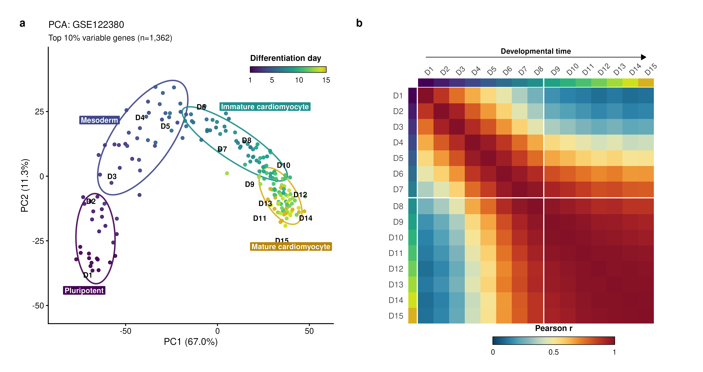
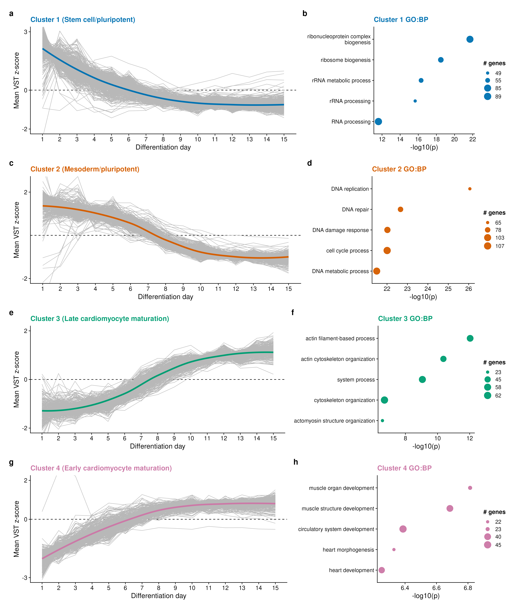
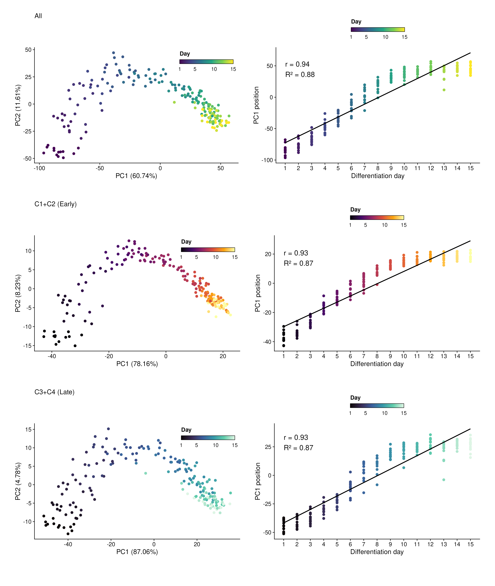
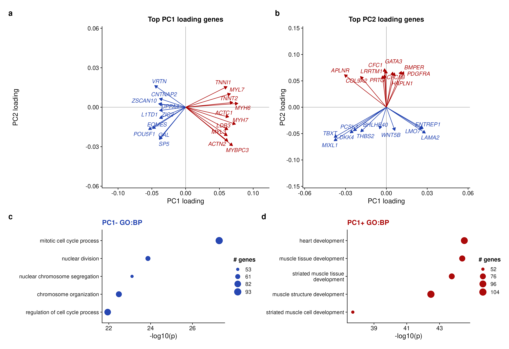
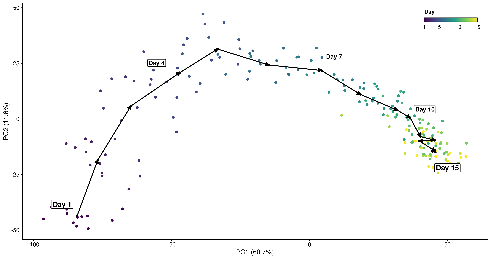
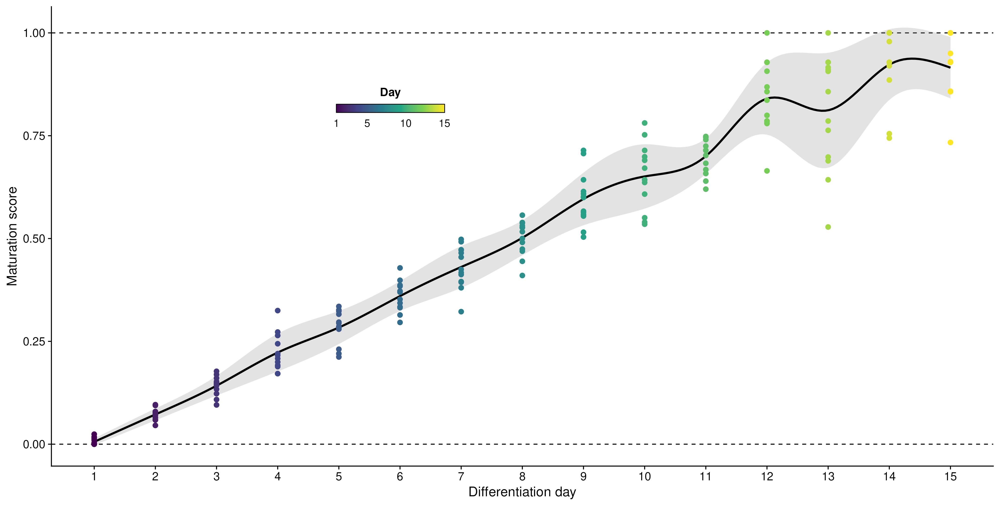
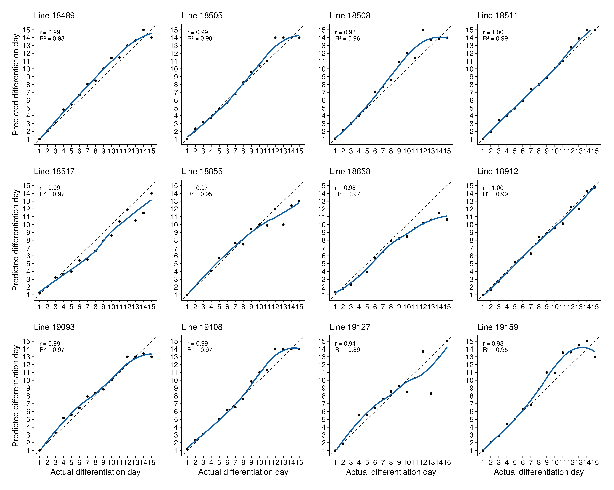
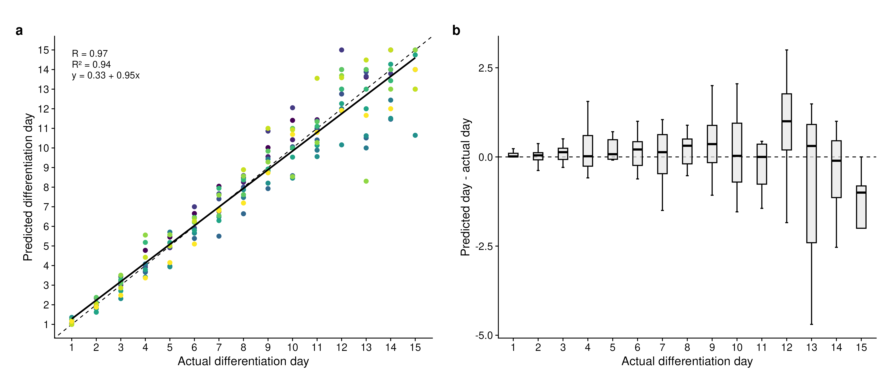
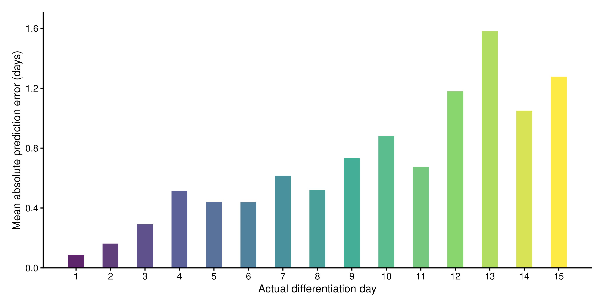

# Differentiation Timing Score

Bulk RNA-seq workflow for scoring differentiation timing from a reference
time-course trajectory. The tutorial uses the QC-processed GSE122380
iPSC-to-cardiomyocyte differentiation dataset and a polyline-based PCA scoring
method.

Rendered tutorial: `https://zohebkhan1.github.io/pca-maturation-scoring/report/`

## Use The Scoring Function

The reusable scorer is a single R file. It does not run DESeq2, make figures, or
write outputs; it takes normalized expression, metadata, and a temporal gene set,
then returns sample scores along the fitted reference polyline.

```r
base_url <- "https://raw.githubusercontent.com/ZohebKhan1/pca-maturation-scoring/main/functions"

download.file(
  paste0(base_url, "/score_differentiation_timing.R"),
  "score_differentiation_timing.R"
)

source("score_differentiation_timing.R")
```

Minimal usage:

```r
timing_fit <- score_differentiation_timing(
  expression_matrix = vst_matrix,
  metadata = sample_metadata,
  temporal_genes = temporal_genes,
  sample_id_col = "sample_id",
  time_col = "day_numeric",
  reference_col = "condition",
  reference_values = "control",
  n_pcs = 3
)

head(timing_fit$scores)
```

## Repository Tree

```text
differentiation_score/
├── data/                         QC-processed GSE122380 input objects
├── functions/                    Standalone polyline timing scorer
├── report/                       Bookdown source, assets, and rendered site
│   ├── assets/figures/           Tutorial figure PNG/SVG outputs
│   ├── index.html                Rendered GitHub Pages-ready tutorial
│   └── tutorial.Rmd              Tutorial source
├── scripts/                      Maintained analysis and render scripts
├── .gitignore                    Local cache, scratch, and agent-file rules
└── README.md                     Repository overview
```

## Data

The repository includes only the compact QC-processed objects needed by the
tutorial:

- `data/GSE122380_metadata.rds`: sample metadata
- `data/GSE122380_counts.rds`: filtered raw count matrix
- `data/GSE122380_vst.rds`: variance-stabilized expression matrix

Raw FASTQ/count preprocessing files are intentionally excluded.

## Workflow

Build tutorial objects and figures:

```bash
Rscript scripts/01_build_tutorial_objects.R
```

Optionally run leave-one-line-out validation:

```bash
Rscript scripts/02_run_leave_one_line_out_validation.R
```

Render the tutorial site:

```bash
Rscript scripts/03_render_tutorial_site.R
```

The rendered site is written to `report/index.html`.

## Method Summary

The workflow identifies temporal genes using day-level expression support,
DESeq2 likelihood-ratio testing, and VST-scale dynamic-range filtering. PCA is
trained on the selected temporal genes. Reference day centroids are connected
into an ordered polyline through retained PC space, and each sample is scored by
the nearest position along that fitted polyline. The day 1 centroid anchors score
0 and the day 15 centroid anchors score 1.

The standalone function in `functions/score_differentiation_timing.R` implements
only the PCA/polyline scoring step. Temporal gene selection and validation are
kept in the tutorial scripts so users can adapt those decisions explicitly.

## Figures

### Figure 1. Experimental structure of the GSE122380 differentiation time course

Panel a shows PCA of all samples using the top 10% most variable VST genes,
colored by differentiation day. Panel b shows the Pearson correlation matrix of
replicate-collapsed day profiles using the same variable-gene set.



### Figure 2. Temporal-gene heatmap

Z-scored VST expression for the top 1,500 temporally variable genes after
expression, LRT, and dynamic-range filtering. Rows are split into four temporal
clusters, and columns are ordered by differentiation day.


### Figure 3. Temporal gene clusters and GO enrichment

Temporal gene clusters and GO biological process enrichment from the top 1,500
temporally variable genes. Each row shows one k=4 cluster trajectory summary and
its top enriched GO terms.



### Figure 4. Reference PCA and PC1-day relationships

Reference PCA and PC1-day relationships for the final temporal gene set, the
early C1+C2 temporal clusters, and the late C3+C4 temporal clusters.



### Figure 5. PCA loading-gene annotation and GO enrichment

Panel a shows top PC1-negative and PC1-positive genes as loading vectors in
PC1/PC2 loading space. Panel b shows top PC2-negative and PC2-positive genes
using the same vector definition. Panels c-d show GO biological process
enrichment among the top 500 PC1-negative and PC1-positive loading genes.



### Figure 6. Differentiation timing polyline

Differentiation timing polyline in reference PCA space. Small black points mark
day-level mean PCA centroids, and the black arrows connect those centroids in
differentiation-day order. The day 1 centroid maps to score 0, and the day 15
centroid maps to score 1.



### Figure 7. Polyline differentiation timing scores

Polyline differentiation timing scores across differentiation day. The gray band
shows the day-level standard deviation around the mean score.



### Figure 8. Leave-one-line-out predicted trajectories

Leave-one-line-out predicted differentiation-day trajectories. Each panel is one
held-out cell line, with black dots for held-out samples and the panel-specific
correlation shown in the upper left.



### Figure 9. Leave-one-line-out validation summary

Panel a shows predicted versus actual differentiation day for held-out samples.
Panel b shows residuals, calculated as predicted day minus actual day.



### Figure 10. Leave-one-line-out prediction error by day

Bars show the mean absolute difference between predicted and actual
differentiation day among held-out samples at each timepoint. Smaller values
indicate closer predictions.



## Key Dependencies

Package versions used for the current rendered tutorial:

| Package         | Version |
| --------------- | ------: |
| DESeq2          |  1.52.0 |
| ComplexHeatmap  |  2.28.0 |
| clusterProfiler |  4.20.0 |
| ggplot2         |   4.0.3 |
| org.Hs.eg.db    |  3.23.1 |
| patchwork       |   1.3.2 |
| svglite         |   2.2.2 |
| viridis         |   0.6.5 |
| edgeR           |  4.10.1 |
| bookdown        |    0.46 |

## References

1. Love MI, Huber W, Anders S. Moderated estimation of fold change and
   dispersion for RNA-seq data with DESeq2. _Genome Biology_. 2014;15:550.
2. Strober BJ, Elorbany R, Rhodes K, et al. Dynamic genetic regulation of gene
   expression during cellular differentiation. _Science_. 2019;364:1287-1290.
3. Xie Y. _bookdown: Authoring Books and Technical Documents with R Markdown_. 2016.

## Contact

**Author:** Zoheb Khan

**Affiliation:** Bioinformatician @ Moskowitz Lab at the University of Chicago Department of Pathology, Pediatrics, and Human Genetics

**Email:** zohebkhan600@gmail.com

**Website:** https://zohebkhan1.github.io/
