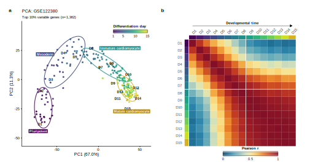
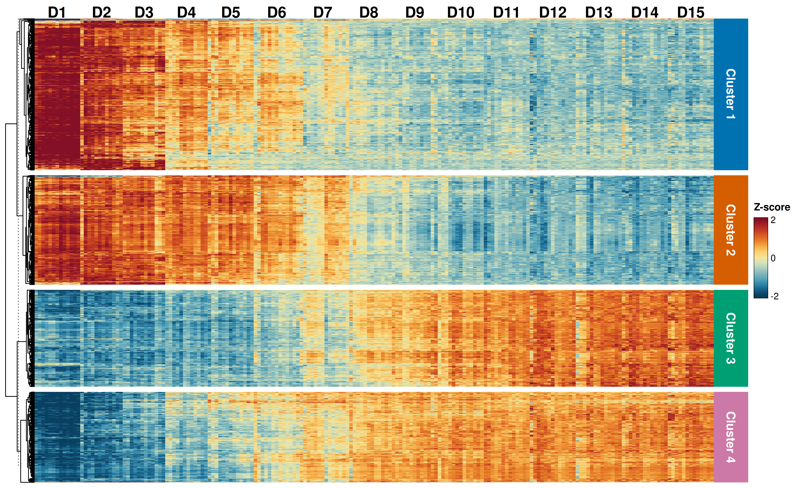
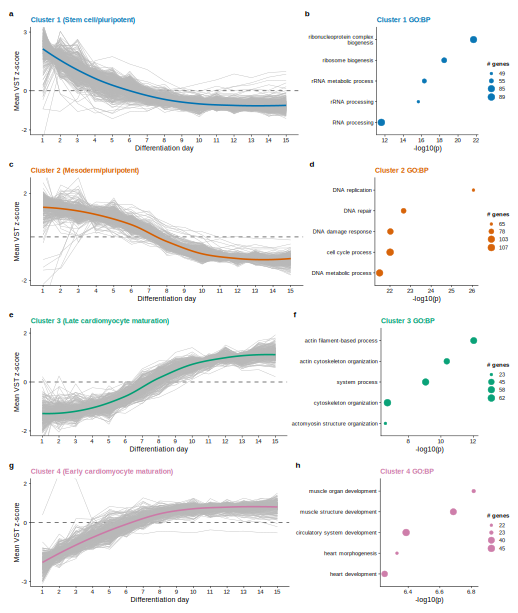
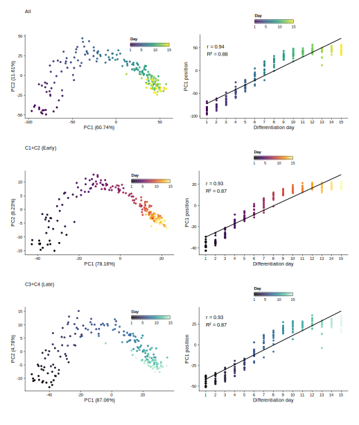
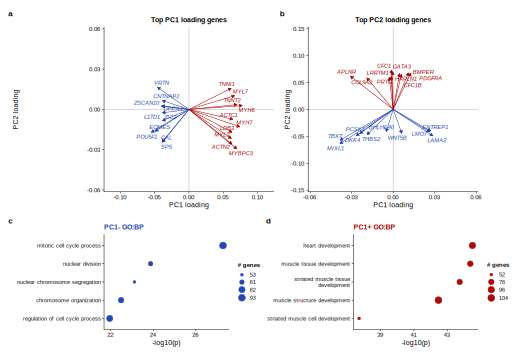
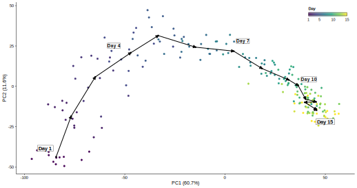
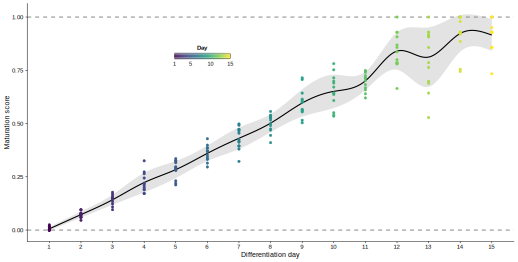
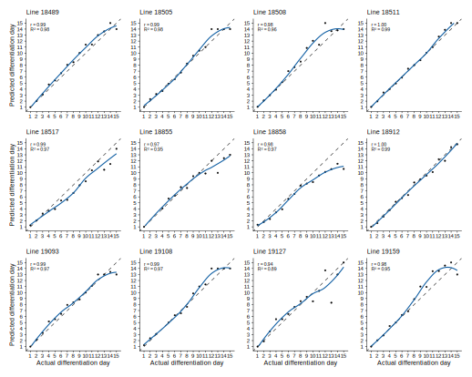
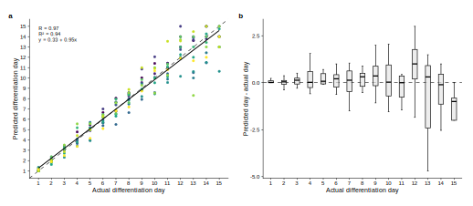
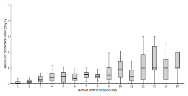

```{r meta-versions, include=FALSE}
tutorial_dependency_packages <- base::c(
  "DESeq2",
  "ComplexHeatmap",
  "clusterProfiler",
  "ggrepel",
  "ggplot2",
  "org.Hs.eg.db",
  "patchwork",
  "svglite",
  "viridis"
)

tutorial_dependency_text <- base::paste(
  base::sprintf(
    "%s %s",
    tutorial_dependency_packages,
    base::vapply(
      tutorial_dependency_packages,
      function(pkg) base::as.character(utils::packageVersion(pkg)),
      base::character(1)
    )
  ),
  collapse = "; "
)

tutorial_bioc_version <- if (base::requireNamespace("BiocManager", quietly = TRUE)) {
  base::as.character(BiocManager::version())
} else {
  "not available"
}
```

<div class="tutorial-title-block">
<h1 class="title">Differentiation timing score</h1>
<div class="tutorial-subtitle">PCA-based scoring of differentiation timing from bulk RNA-seq time-course data</div>

<div class="tutorial-meta-block">
<div><span>Authors:</span> Zoheb Khan [aut, cre]</div>
<div><span>Version:</span> 0.0.0.9000</div>
<div><span>Modified:</span> 2026-07-06</div>
<div><span>Compiled:</span> `r base::format(base::Sys.Date(), "%Y-%m-%d")`</div>
<div><span>Environment:</span> R version `r base::as.character(base::getRversion())`</div>
<div><span>Bioconductor:</span> `r tutorial_bioc_version`</div>
<div><span>Dependencies:</span> `r tutorial_dependency_text`</div>
<div><span>Source:</span> <a href="https://github.com/ZohebKhan1/pca-maturation-scoring">https://github.com/ZohebKhan1/pca-maturation-scoring</a></div>
</div>
</div>

```{r setup, include=FALSE}
knitr::opts_chunk$set(
  echo = FALSE,
  warning = FALSE,
  message = FALSE,
  fig.align = "center"
)

code_file <- if (base::file.exists("../scripts/01_build_tutorial_objects.R")) {
  "../scripts/01_build_tutorial_objects.R"
} else {
  "scripts/01_build_tutorial_objects.R"
}
base::source(code_file)
```

# Introduction

This tutorial shows a reference-trajectory workflow for scoring differentiation timing from bulk RNA-seq data. The worked example uses processed GSE122380 iPSC-to-cardiomyocyte differentiation samples. The active input contains 192 samples across 15 daily timepoints, from day 1 through day 15, and 13 independent cell lines. The score is trained from the retained reference time course and then expresses each sample as a continuous coordinate along that fitted differentiation trajectory.

The tutorial has four goals:

1. define temporal genes from a reference time course
2. train a PCA space using those genes
3. fit and normalize a differentiation timing polyline
4. validate transferability by holding out cell lines

The complete runnable analysis code is stored separately in `scripts/01_build_tutorial_objects.R`. The report figures are generated by that script as named PNG and SVG files under `report/assets/figures/`.

# Download the scoring function

The reusable scoring function is available as a standalone R file. It assumes temporal genes have already been selected, then trains the PCA space, fits the ordered day-centroid polyline, projects samples into that fixed space, and returns polyline timing scores. It does not run DESeq2, select genes, make figures, or write files.

```{r download-scoring-function, eval=FALSE, echo=TRUE}
base_url <- "https://raw.githubusercontent.com/ZohebKhan1/pca-maturation-scoring/main/functions"

download.file(
  paste0(base_url, "/score_differentiation_timing.R"),
  "score_differentiation_timing.R"
)

source("score_differentiation_timing.R")
```

The main parameters are:

- `expression_matrix`: a normalized expression matrix, with genes as rows and samples as columns. The example workflow uses VST expression values.
- `metadata`: sample-level metadata. It must contain one row per sample in `expression_matrix`.
- `temporal_genes`: genes used to train the PCA space and reference trajectory. These should be selected before scoring, for example by the temporal-gene filtering workflow shown below.
- `sample_id_col`: metadata column containing sample IDs that match `colnames(expression_matrix)`.
- `time_col`: numeric differentiation time column used to order the reference centroids.
- `reference_col` and `reference_values`: optional metadata column and value set used to define the reference samples. If these are omitted, all samples are treated as reference samples.
- `n_pcs`: number of retained PCs used for the centroid polyline and projection. The tutorial uses the first three PCs.

The function returns a list containing `scores`, `pca_coordinates`, the fitted `pca_fit`, the fitted `centroid_polyline`, the retained `temporal_genes`, and the normalized reference time range.

# GSE122380 bulk RNA-seq time-course dataset

The example uses <a href="https://www.ncbi.nlm.nih.gov/geo/query/acc.cgi?acc=GSE122380">GSE122380</a>, an iPSC-derived cardiomyocyte differentiation bulk RNA-seq time course generated by Strober, Elorbany, Rhodes et al. The data used here have already been processed into aligned metadata, raw-count, and variance-stabilized expression objects. There are no perturbation samples in the active tutorial dataset; all retained samples are treated as one reference trajectory.

```{r sample-summary-table, echo=FALSE}
sample_summary <- stats::aggregate(
  sample_id ~ day_numeric,
  data = meta,
  FUN = length
)

cell_line_summary <- stats::aggregate(
  cell_line ~ day_numeric,
  data = meta,
  FUN = function(x) base::length(base::unique(x))
)

data_summary <- base::merge(sample_summary, cell_line_summary, by = "day_numeric")
base::names(data_summary) <- base::c("day", "Total samples", "Unique cell lines")
data_summary <- data_summary[base::order(data_summary$day), ]

summary_table <- base::rbind(
  Samples = data_summary[["Total samples"]],
  `Cell lines` = data_summary[["Unique cell lines"]]
)

summary_table <- base::data.frame(
  Metric = base::rownames(summary_table),
  summary_table,
  row.names = NULL,
  check.names = FALSE
)
base::names(summary_table)[-1] <- base::paste0("D", data_summary$day)

knitr::kable(
  summary_table,
  format = "html",
  table.attr = 'class="sample-summary-table"',
  align = c("l", rep("r", ncol(summary_table) - 1)),
  caption = "Sample overview for the GSE122380 dataset used in this tutorial."
)
```

The figure below provides a compact overview of the reference time course. Panel a shows the global time-course structure by PCA, and panel b shows the day-collapsed Pearson correlation matrix using the same top-variable-gene set.

```{r reference-pca-and-correlation, echo=FALSE, results='asis', out.width='96%', fig.align='center'}
cat('<div id="fig-reference-overview" class="figure-anchor"></div>\n')

```

<div class="tutorial-figure-caption"><strong>Figure 1.</strong> Experimental structure of the GSE122380 differentiation time course. <strong>a.</strong> PCA of all samples using the top 10% most variable VST genes, colored by differentiation day. <strong>b.</strong> Pearson correlation matrix of replicate-collapsed day profiles using the same variable-gene set as in 1A; row and column annotations encode differentiation day.</div>

# Method

The differentiation timing score reduces a multi-gene time course to a one-dimensional coordinate. The calculation has four defined steps: select temporal genes, train a PCA space, fit an ordered day-centroid polyline, and score samples by the nearest position along that polyline. The equations below are limited to those operations.

**Step 1. Select temporal genes.** Genes are retained only if they pass all three temporal-feature filters: day-level expression support, DESeq2 LRT evidence, and day-mean VST dynamic range. This avoids training the trajectory on genes that are statistically non-temporal, too lowly expressed, or numerically flat across the time course. For each gene, DESeq2 compares a full model that includes differentiation day against a reduced model without day:

\[
\mathrm{full}: y \sim \mathrm{cell\ line} + \mathrm{day},
\qquad
\mathrm{reduced}: y \sim \mathrm{cell\ line}.
\tag{1}
\]

The likelihood-ratio statistic is

\[
\mathrm{LR} =
-2\ln\left(\frac{L_{\mathrm{reduced}}}{L_{\mathrm{full}}}\right)
=
2\left(\ell_{\mathrm{full}} - \ell_{\mathrm{reduced}}\right),
\tag{2}
\]

where \(L\) is the maximized likelihood and \(\ell\) is the maximized log-likelihood for the corresponding fit. Genes with small adjusted LRT p-values have evidence that expression changes across differentiation day after accounting for cell-line structure.

**Step 2. Train the PCA coordinate system.** Let \(X \in \mathbb{R}^{n \times p}\) be the reference expression matrix for \(n\) samples and \(p\) selected temporal genes. PCA is trained after centering each gene. If \(\mathbf{x}_i\) is the row vector for sample \(i\), \(\boldsymbol{\mu}\) is the reference gene-mean vector, and \(W_k \in \mathbb{R}^{p \times k}\) contains the retained PCA loading vectors, then the retained PCA coordinate is

\[
\mathbf{z}_i = (\mathbf{x}_i - \boldsymbol{\mu}) W_k.
\tag{3}
\]

Below, PCA coordinates are treated as points in the retained Euclidean PC space. Inner products are written with angle brackets so the projection formulas do not depend on whether a vector is stored as a row or column in software.

**Step 3. Fit the day-centroid polyline.** For each ordered differentiation day \(t_j\), let \(I_j\) be the samples collected at that day. The day centroid is the mean PCA coordinate:

\[
\mathbf{c}_j =
\frac{1}{|I_j|}
\sum_{i \in I_j} \mathbf{z}_i,
\qquad
j = 1,\ldots,m.
\tag{4}
\]

The ordered centroids \(\mathbf{c}_1,\ldots,\mathbf{c}_m\) define a piecewise-linear trajectory. Segment \(j\) starts at \(\mathbf{a}_j=\mathbf{c}_j\), ends at \(\mathbf{b}_j=\mathbf{c}_{j+1}\), and has direction \(\mathbf{v}_j=\mathbf{b}_j-\mathbf{a}_j\).

This scoring method assumes consecutive day centroids are distinct; a degenerate segment with \(\mathbf{v}_j=\mathbf{0}\) would be dropped before projection. It also assumes the ordered day centroids define a roughly monotonic differentiation trajectory in the retained PC space. If the trajectory folds back on itself, nearest-segment projection can assign a sample to an out-of-order part of the polyline.

**Step 4. Project and score each sample.** For sample \(i\) and segment \(j\), the fractional position along that segment is

\[
\alpha_{ij}
=
\operatorname{clip}_{[0,1]}
\left(
\frac{\langle \mathbf{z}_i-\mathbf{a}_j, \mathbf{v}_j \rangle}
{\langle \mathbf{v}_j, \mathbf{v}_j \rangle}
\right).
\tag{5}
\]

The clipped value \(\alpha_{ij}\) keeps the projection on the finite segment rather than on the infinite line through that segment. The projected point on segment \(j\) is

\[
\mathbf{q}_{ij} = \mathbf{a}_j + \alpha_{ij}\mathbf{v}_j.
\tag{6}
\]

The selected segment is the one whose projected point is closest to the sample in retained PC space:

\[
j^\ast
=
\underset{j}{\operatorname{argmin}}
\left\lVert \mathbf{z}_i - \mathbf{q}_{ij} \right\rVert^2.
\tag{7}
\]

The segment fraction is then converted to an interpolated differentiation day:

\[
\widehat{t}_i =
t_{j^\ast}
+
\alpha_{ij^\ast}
\left(t_{j^\ast+1} - t_{j^\ast}\right).
\tag{8}
\]

Finally, the timing score is normalized to the fitted reference interval:

\[
s_i =
\frac{\widehat{t}_i - t_{\mathrm{start}}}{t_{\mathrm{end}} - t_{\mathrm{start}}}.
\tag{9}
\]

In this tutorial \(t_{\mathrm{start}}=1\) and \(t_{\mathrm{end}}=15\), so the day 1 centroid anchors score 0 and the day 15 centroid anchors score 1. Scores below 0 or above 1 are allowed for future projection datasets if a sample maps before or after the fitted reference interval.

# Computing the differentiation timing score

## Identify time-variant genes

The LRT compares a full model with cell line and day against a reduced model with cell line only, but the final temporal gene set also requires expression support and VST-scale dynamic range. A gene is retained if its maximum day-level mean TMM CPM is at least 10, its LRT-adjusted p-value is below `1e-7`, and the difference between its maximum and minimum day-level mean VST values is at least 0.6.

```{r temporal-filter-code, eval=FALSE, echo=TRUE}
day_mean_tmm_cpm <- mean_tmm_cpm_by_day(
  count_matrix = counts,
  metadata_df = meta,
  day_values = days
)
max_day_mean_tmm_cpm <- apply(day_mean_tmm_cpm, 1, max, na.rm = TRUE)

expression_genes <- names(max_day_mean_tmm_cpm)[
  max_day_mean_tmm_cpm >= 10
]

dds <- DESeq2::DESeqDataSetFromMatrix(
  countData = counts[expression_genes, , drop = FALSE],
  colData = lrt_meta,
  design = ~ cell_line + day_factor
)

dds <- DESeq2::DESeq(dds, test = "LRT", reduced = ~cell_line, quiet = TRUE)
lrt_res <- as.data.frame(DESeq2::results(dds, alpha = 1e-7))

lrt_genes <- rownames(lrt_res)[!is.na(lrt_res$padj) & lrt_res$padj < 1e-7]
day_mean_vst <- mean_vst_by_day(vst[lrt_genes, , drop = FALSE], meta, days)
vst_dynamic_range <- apply(day_mean_vst, 1, function(x) max(x) - min(x))

temporal_genes <- lrt_genes[vst_dynamic_range[lrt_genes] >= 0.6]
```

```{r lrt-summary-table, echo=FALSE}
lrt_display <- base::data.frame(
  Metric = base::c(
    "Genes in filtered count/VST input",
    "Genes with max day mean TMM CPM >= 10",
    "Genes tested by DESeq2 LRT",
    "Genes passing LRT padj < 1e-7",
    "Genes passing VST dynamic range >= 0.6",
    "Temporal genes used for PCA/scoring",
    "Temporal clusters shown"
  ),
  Value = base::c(
    base::format(lrt_summary$total_expressed_genes, big.mark = ","),
    base::format(lrt_summary$genes_passing_day_mean_tmm_cpm, big.mark = ","),
    base::format(lrt_summary$genes_tested_by_lrt, big.mark = ","),
    base::format(lrt_summary$genes_passing_lrt_padj, big.mark = ","),
    base::format(lrt_summary$genes_passing_vst_dynamic_range, big.mark = ","),
    base::format(lrt_summary$genes_passing_vst_dynamic_range, big.mark = ","),
    "4"
  ),
  stringsAsFactors = FALSE
)

knitr::kable(
  lrt_display,
  format = "html",
  table.attr = 'class="sample-summary-table"',
  align = c("l", "r"),
  caption = "Sequential temporal gene-filtering summary."
)
```

The heatmap shows the top 1,500 genes from the final temporal set to keep the visualization readable. PCA fitting, scoring, and validation use the full final temporal set.

```{r temporal-heatmap, echo=FALSE, results='asis', out.width='62%', fig.align='center'}
cat('<div id="fig-temporal-heatmap" class="figure-anchor"></div>\n')

```

<div class="tutorial-figure-caption"><strong>Figure 2.</strong> Z-scored VST expression for the top 1,500 temporally variable genes after expression, LRT, and dynamic-range filtering. Rows are split into four temporal clusters, and columns are ordered by differentiation day.</div>

The cluster panel uses k=4 only for interpretation. Clusters, trajectory summaries, and GO enrichment are all computed from the same top 1,500 temporally variable genes shown in the heatmap.

```{r temporal-clusters, echo=FALSE, results='asis', out.width='96%', fig.align='center'}
cat('<div id="fig-temporal-clusters" class="figure-anchor"></div>\n')

```

<div class="tutorial-figure-caption"><strong>Figure 3.</strong> Temporal gene clusters and GO biological process enrichment from the top 1,500 temporally variable genes. Each row shows one k=4 cluster trajectory summary and its top enriched GO terms.</div>

## Train PCA space on the reference time course

The PCA space is trained using the final temporal gene set. PC1 is oriented so that it increases with differentiation day. The figure also shows two interpretive subsets from the k=4 heatmap clusters: C1+C2 captures the earlier temporal cluster patterns, and C3+C4 captures the later temporal cluster patterns.

```{r pca-training-code, eval=FALSE, echo=TRUE}
pca_input <- t(vst[temporal_genes, , drop = FALSE])
pca_fit <- prcomp(pca_input, center = TRUE, scale. = FALSE)
pca_fit <- orient_pca_fit_by_day(pca_fit, sample_days)

pca_df <- data.frame(
  sample_id = rownames(pca_fit$x),
  PC1 = pca_fit$x[, 1],
  PC2 = pca_fit$x[, 2],
  PC3 = pca_fit$x[, 3],
  meta[match(rownames(pca_fit$x), meta$sample_id), ],
  row.names = NULL
)
```

```{r pca-day, echo=FALSE, results='asis', out.width='96%', fig.align='center'}
cat('<div id="fig-pca-day" class="figure-anchor"></div>\n')

```

<div class="tutorial-figure-caption"><strong>Figure 4.</strong> Reference PCA and PC1-day relationships for the final temporal gene set, the early C1+C2 temporal clusters, and the late C3+C4 temporal clusters.</div>

The loading validation figure shows the top 10 negative and top 10 positive PC1 loading genes and PC2 loading genes as vectors in PC1/PC2 loading space, then summarizes GO biological process enrichment for the top 500 genes in each PC1 direction.

```{r pc1-validation, echo=FALSE, results='asis', out.width='96%', fig.align='center'}
cat('<div id="fig-pc1-validation" class="figure-anchor"></div>\n')

```

<div class="tutorial-figure-caption"><strong>Figure 5.</strong> PCA loading-gene annotation and GO enrichment. <strong>a.</strong> Top PC1-negative and PC1-positive genes are shown as loading vectors in PC1/PC2 loading space. <strong>b.</strong> Top PC2-negative and PC2-positive genes are shown using the same vector definition. <strong>c-d.</strong> GO biological process enrichment among the top 500 PC1-negative and PC1-positive loading genes.</div>

## Fit the differentiation timing polyline

After the PCA space is defined, day-level centroids are connected into an ordered polyline. This preserves curvature in the reference trajectory instead of forcing the full time course onto one straight D1-to-D15 vector. The same piecewise-linear centroid polyline shown in the figure is used for scoring.

```{r polyline-fit-code, eval=FALSE, echo=TRUE}
centroid_polyline <- calculate_centroid_polyline(
  fit_pca_df = pca_df,
  pc_columns = c("PC1", "PC2", "PC3")
)

polyline_projection <- project_points_to_polyline(
  points_df = pca_df,
  polyline_df = centroid_polyline,
  pc_columns = c("PC1", "PC2", "PC3")
)
```

```{r timing-polyline, echo=FALSE, results='asis', out.width='86%', fig.align='center'}
cat('<div id="fig-timing-polyline" class="figure-anchor"></div>\n')

```

<div class="tutorial-figure-caption"><strong>Figure 6.</strong> Differentiation timing polyline in reference PCA space. Small black points mark day-level mean PCA centroids, and the black arrows connect those centroids in differentiation-day order. The day 1 centroid maps to score 0, and the day 15 centroid maps to score 1.</div>

## Score samples along the fixed polyline

This tutorial projects the retained reference samples back into the trained space to show the expected scoring behavior. In a perturbation or genotype comparison, non-reference samples would be projected into this already-trained PCA space and scored against the same fixed centroid polyline.

```{r polyline-score-code, eval=FALSE, echo=TRUE}
pca_df$maturation_score <- polyline_projection$maturation_score
pca_df$polyline_day <- polyline_projection$polyline_day
pca_df$polyline_segment_start_day <- polyline_projection$segment_start_day
pca_df$polyline_segment_end_day <- polyline_projection$segment_end_day
pca_df$polyline_segment_fraction <- polyline_projection$segment_fraction
pca_df$polyline_squared_distance <- polyline_projection$squared_distance
```

```{r score-by-day, echo=FALSE, results='asis', out.width='96%', fig.align='center'}
cat('<div id="fig-score-by-day" class="figure-anchor"></div>\n')

```

<div class="tutorial-figure-caption"><strong>Figure 7.</strong> Polyline differentiation timing scores across differentiation day. The gray band shows the day-level standard deviation around the mean score.</div>

# Leave-one-line-out validation

The validation repeats the workflow while holding out one cell line at a time. For each held-out line, temporal genes are reidentified from the remaining reference lines using the same CPM, LRT, and VST dynamic-range filters; PCA and the centroid polyline are trained on those remaining samples; and the held-out samples are projected into that trained space. The panel grid excludes held-out line `19190` only for display so the validation figure fits a 3-row by 4-column layout.

```{r loo-summary-table, echo=FALSE, results='asis'}
if (has_loo_validation) {
  knitr::kable(
    loo_accuracy_summary,
    format = "html",
    table.attr = 'class="sample-summary-table"',
    align = c("l", "r"),
    caption = "Leave-one-line-out validation summary."
  )
} else {
  cat('<p><em>Leave-one-line-out validation cache was not found at render time, so this optional section has no validation figures.</em></p>')
}
```

```{r loo-line-predictions, echo=FALSE, results='asis', out.width='96%', fig.align='center'}
if (has_loo_validation) {
  cat('<div id="fig-loo-line-predictions" class="figure-anchor"></div>\n')
  
}
```

<div class="tutorial-figure-caption"><strong>Figure 8.</strong> Leave-one-line-out predicted differentiation-day trajectories. Each panel is one held-out cell line, with black dots for held-out samples and the panel-specific correlation shown in the upper left.</div>

```{r loo-summary-figure, echo=FALSE, results='asis', out.width='96%', fig.align='center'}
if (has_loo_validation) {
  cat('<div id="fig-loo-summary" class="figure-anchor"></div>\n')
  
}
```

<div class="tutorial-figure-caption"><strong>Figure 9.</strong> Leave-one-line-out validation summary. <strong>a.</strong> Predicted versus actual differentiation day for held-out samples. <strong>b.</strong> Residuals, calculated as predicted day minus actual day.</div>

```{r loo-timepoint-accuracy, echo=FALSE, results='asis', out.width='72%', fig.align='center'}
if (has_loo_validation) {
  cat('<div id="fig-loo-timepoint-accuracy" class="figure-anchor"></div>\n')
  
}
```

<div class="tutorial-figure-caption"><strong>Figure 10.</strong> Leave-one-line-out prediction error by differentiation day. Boxplots show the absolute difference between predicted and actual differentiation day among held-out samples at each timepoint; lower values indicate closer predictions.</div>

# References

<ol class="reference-list">
<li id="ref-deseq2"><strong>1.</strong> Love MI, Huber W, Anders S. Moderated estimation of fold change and dispersion for RNA-seq data with DESeq2. <em>Genome Biology</em>. 2014;15:550.</li>
<li id="ref-strober"><strong>2.</strong> Strober BJ, Elorbany R, Rhodes K, et al. Dynamic genetic regulation of gene expression during cellular differentiation. <em>Science</em>. 2019;364:1287-1290.</li>
<li id="ref-bookdown"><strong>3.</strong> Xie Y. <em>bookdown: Authoring Books and Technical Documents with R Markdown</em>. 2016.</li>
</ol>

# Session Info

```{r session-info}
sessionInfo()
```
