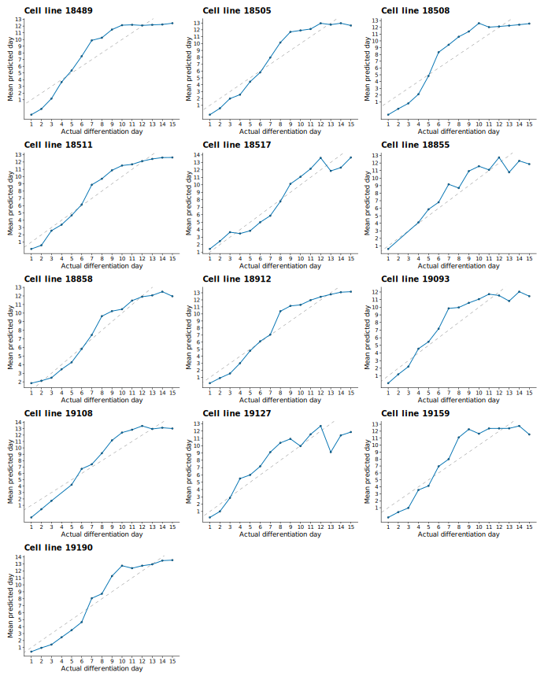
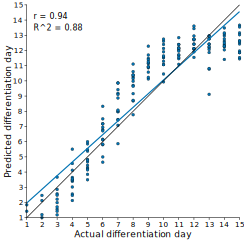
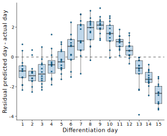

```{r setup, include=FALSE}
knitr::opts_chunk$set(
  echo = FALSE,
  warning = FALSE,
  message = FALSE,
  fig.path = "assets/figures/",
  dpi = 600,
  fig.align = "center"
)
code_file <- if (base::file.exists("cardiomyocyte_maturation_score_analysis.R")) {
  "cardiomyocyte_maturation_score_analysis.R"
} else {
  "scripts/cardiomyocyte_maturation_score_analysis.R"
}
base::source(code_file)
```

# Overview of maturation scoring method

This tutorial demonstrates a PCA-based maturation scoring workflow for
time-series bulk RNA-seq data. The example dataset is QC-processed
GSE122380 iPSC-to-cardiomyocyte differentiation data. The active example
contains 192 samples collected across 15 daily timepoints from day 1
through day 15. The dataset includes 13 independent cell lines, with one
sample per available cell line at each timepoint. Most timepoints contain
13 samples; days 2, 3, and 4 contain 12 samples because one cell-line
sample is missing at each of those days.

There are no perturbation samples and no trisomy 21 samples in this
dataset. The samples represent different cell lines sampled along the
same differentiation time course. That structure makes the dataset useful
for benchmarking and validating a maturation scoring method: the time
resolution is high, the trajectory spans many ordered stages, and the
cell-line replication lets us test whether the score tracks day while
remaining stable across genetic backgrounds.

All retained samples are treated as one reference trajectory. The
analysis has five conceptual parts. First, identify genes that vary
across the reference time-course. Second, use those time-variant genes to
train a PCA space using only reference samples. Third, fit a maturation
axis through the reference trajectory using the intermediate timepoints
as well as the start and end of the series. Fourth, project samples into
the reference-trained PCA space. Fifth, normalize the vector so that the
starting timepoint has a maturation score of 0 and the final timepoint
has a maturation score of 1.

The complete runnable analysis code is stored separately in
`scripts/cardiomyocyte_maturation_score_analysis.R`.

## Core principle of maturation scoring

The core principle is simple. After defining a reference differentiation
trajectory, each sample receives a score based on where it falls along
that trajectory. Instead of scoring one marker gene at a time, the
workflow reduces a time-variant gene signature into a small number of
principal components. A line of best fit through the reference samples
then becomes the maturation axis.

The PCA space should be trained only on reference samples.
Non-reference samples are then projected into that fixed space and
compared against the reference maturation axis. This prevents treatment,
genotype, or batch-specific variation from defining the differentiation
trajectory itself.

```{r overview-vector, fig.cap="Best-fit maturation vector in reference PCA space.", fig.width=6.2, fig.height=4.6}
p_vector
```

# Background

Time-course differentiation experiments often contain samples spread
across days, donors, and batches. A direct day-by-day comparison is
useful, but it does not give a single continuous coordinate for
progression along the reference trajectory.

This workflow turns the time course into that coordinate. Samples near
the first reference timepoint score near 0. Samples near the final
reference timepoint score near 1. Values outside that range are allowed;
they indicate that a sample projects earlier or later than the fitted
reference interval along the same axis.

In this cardiomyocyte example, all retained samples are treated as the
reference trajectory. In experiments with additional conditions, those
non-reference samples would be projected into the fixed reference space
after the PCA model and best-fit line are learned.

In practical terms, the score asks: where does this sample fall along
the reference differentiation trajectory, after reducing the selected
temporal genes to the leading PCs?

## Mathematical principles

The maturation score reduces a multi-gene expression trajectory to a
one-dimensional coordinate. First, temporal genes are selected,
typically using a likelihood ratio test for a day effect. VST expression
values for those genes are then used to train PCA on the reference
samples only. Other samples are not used to learn the PCA space; they
are projected into the reference-defined space afterward.

Let \(X \in \mathbb{R}^{n \times p}\) be the expression matrix for
\(n\) samples and \(p\) selected temporal genes, and let
\(\mathbf{x}_i\) denote the expression vector for sample \(i\). PCA is
trained on the reference samples after centering each gene by its
reference-sample mean. If `scoring_pca_scale = TRUE`, genes are also
divided by their reference-sample standard deviation before PCA.

For the unscaled case, the PCA coordinates for sample \(i\) are

\[
\mathbf{z}_i = (\mathbf{x}_i - \boldsymbol{\mu}) W_k.
\]

Here, \(\boldsymbol{\mu}\) is the vector of reference-sample gene means
and \(W_k\) contains the first \(k\) PCA loading vectors. With PCA
scaling enabled, the same equation is applied after dividing each
centered gene by its reference-sample standard deviation.

The best-fit maturation axis is fit by regressing each retained PCA
coordinate on differentiation day. This means the line is not drawn only
between the observed first and final timepoint centroids. Instead, the
intermediate timepoints contribute to the fitted trajectory, so the
resulting axis represents the dominant temporal direction across the full
reference series. The fitted line is then evaluated at the first and
final reference days:

\[
\mathbf{v} =
\widehat{\mathbf{z}}_{t_{\mathrm{end}}} -
\widehat{\mathbf{z}}_{t_{\mathrm{start}}}.
\]

Each sample is scored by projecting its PCA coordinate onto this axis and
normalizing by the squared length of the axis:

\[
s_i =
\frac{
(\mathbf{z}_i - \widehat{\mathbf{z}}_{t_{\mathrm{start}}})^\top \mathbf{v}
}{
\mathbf{v}^\top \mathbf{v}
}.
\]

This normalization anchors the fitted reference trajectory so that

\[
s(\widehat{\mathbf{z}}_{t_{\mathrm{start}}}) = 0,
\qquad
s(\widehat{\mathbf{z}}_{t_{\mathrm{end}}}) = 1.
\]

The projected point on the fitted maturation axis is

\[
\widehat{\mathbf{z}}_i =
\widehat{\mathbf{z}}_{t_{\mathrm{start}}} + s_i \mathbf{v}.
\]

The zero point is therefore the fitted day 1 endpoint in the learned PCA
space. A score of 1 is the fitted day 15 endpoint. Scores below 0 or
above 1 are valid; they mean a sample projects earlier or later than the
fitted reference interval along the same axis.

# Required input data

This workflow assumes that you already have variance-stabilized
transformed counts from DESeq2 and that any necessary QC and batch-effect
correction has already been performed. You also need sample metadata and
raw counts, because the LRT is run from the count matrix.

The active tutorial contains 15 differentiation timepoints and 192 total
samples. Most timepoints have 13 replicate cell lines; days 2, 3, and 4
have 12 samples each. Across the full dataset, there are 13 distinct cell
lines.

```{r input-data-summary}
input_summary_table
```

| Object | Class | Meaning |
|---|---|---|
| `GSE122380_metadata.rds` | `data.frame` | sample metadata with `sample_id`, `day_numeric`, `day_factor`, and `cell_line` |
| `GSE122380_counts.rds` | integer matrix | filtered raw counts; genes are rows and samples are columns |
| `GSE122380_vst.rds` | numeric matrix | VST expression matrix; genes are rows and samples are columns |

The sample order is aligned across metadata, counts, and VST objects.

# Computing maturation score

The workflow is organized into four practical analysis steps: identify
time-variant genes, train the reference PCA space, fit the reference
maturation line, and score samples relative to that fitted line.

## Step 1. Identify time-variant genes in reference time-series differentiation

The first step is to identify time-dependent genes in the reference
differentiation. In other words, we define a set of genes whose
expression changes significantly across timepoints. Because the goal is
to score maturation or progression along a differentiation axis, genes
whose expression is constant across differentiation are not useful. They
do not tell us whether a sample is more or less mature.

To compute this time-variant gene signature, we use DESeq2's likelihood
ratio test. A pairwise approach is possible: for example, with five
timepoints, one could test D2 versus D1, D3 versus D2, D4 versus D3, and
D5 versus D4, then take the union of significant genes. That approach is
less clean because it requires many pairwise contrasts and makes the gene
set depend on an arbitrary collection of adjacent comparisons.

The LRT is a simpler way to ask whether a gene changes across more than
two levels. Here, the full model includes cell line and day, while the
reduced model includes cell line only. The null hypothesis is that the
full model does not fit meaningfully better than the reduced model. If
that null is rejected, the day term is capturing significant expression
variation, and the gene is treated as time-variant.

A stage-aware expression filter can be useful in other datasets,
especially if the LRT returns a very large number of low-abundance genes.
For example, one can require each gene to pass a minimum expression
threshold at one or more timepoints to focus on a cleaner
time-dependent gene list. That filter is optional and is not applied in
the analysis shown here.

The LRT compares a full model with cell line and day against a reduced
model with cell line only. The selected temporal gene set is then used
for PCA fitting, heatmap clustering, and cluster-level trajectory plots.

```{r lrt-summary}
lrt_summary_table
```

The annotation bar below clusters samples by Pearson correlation across
the filtered temporal genes. The day annotation shows whether the sample
ordering tracks the differentiation trajectory after temporal genes have
been defined.

```{r temporal-correlation-annotation, fig.cap="Sample clustering from Pearson correlations across LRT-significant temporal genes, annotated by differentiation day.", fig.width=14, fig.height=4}
ComplexHeatmap::draw(
  p_correlation_annotation,
  heatmap_legend_side = 'right',
  annotation_legend_side = 'bottom'
)
```

This is a useful sanity check. If the time-variant genes are capturing
the reference differentiation program, then clustering samples with those
genes should recover a clear timepoint structure.

```{r temporal-heatmap, fig.cap="Z-scored VST expression for the top 1,500 LRT-significant temporal genes. Row clusters are color coded. Columns are ordered by day without visible gaps between day blocks; within each day, samples are clustered to determine order, but the clustering tree is hidden.", fig.width=9, fig.height=5}
ComplexHeatmap::draw(p_lrt_heatmap)
```

Similarly, plotting the top 1,500 LRT-significant temporal genes in a
heatmap shows that several broad categories of time-dependent behavior
emerge. The top genes are used here only to keep the visualization
readable. The full LRT gene set is still used for the main PCA-based
score. The choice of four heatmap clusters is mainly for demonstration:
the point is not that there are exactly four biological modules, but that
the LRT captures genes that decrease, genes that increase, genes that
rise and plateau, and other non-monotonic patterns.

The key takeaway is that this maturation score is not built only from
genes that increase during differentiation. It also includes genes that
decrease, genes with transient behavior, and other classes of
time-variant expression.

```{r temporal-clusters, fig.cap="Mean VST z-score trajectories for the top 1,500 LRT-significant temporal genes grouped into four heatmap clusters.", fig.width=7, fig.height=5}
p_cluster_trajectories
```

## Step 2. Train PC space on reference differentiation samples using time-variant genes

Having defined and validated the time-dependent gene list, we now use
those genes as the input for PCA. Because this is a reference
differentiation trajectory, the PCA space should be learned only from the
reference samples. If non-reference samples are allowed to define the PCA
space, then treatment-specific or genotype-specific variation can
contaminate the PCs, making it harder to interpret the axis as
differentiation.

```{r pca-day, fig.cap="Reference PCA using all LRT-significant temporal genes, paired with the PC1-time relationship.", fig.width=12.5, fig.height=5.2}
p_pca_day
```

The panel grid below compares the early and late heatmap-cluster gene
subsets. Each PCA panel is paired with the corresponding PC1-time
relationship beneath it.

```{r pca-panel-grid, fig.cap="PCA views and PC1-day relationships for early temporal clusters and late temporal clusters.", fig.width=12, fig.height=7.5}
p_pca_grid
```

### PC1 validation

The PC1 validation figure combines loading weights and trajectories for
the strongest positive and negative PC1 genes. Gene labels use symbols
when local annotation packages can resolve the Ensembl IDs; otherwise
the original Ensembl IDs are shown.

```{r pc1-validation, fig.cap="PC1 validation. Panel a shows the top positive and negative PC1 loading genes. Panel b shows mean z-scored VST trajectories for those genes.", fig.width=7, fig.height=7}
p_pc1_validation
```

## Step 3. Compute line of best fit starting at first timepoint and ending at last timepoint

After the PCA space is defined, we fit a line through the reference
trajectory in PC space. The fitted line is evaluated at the first and
last timepoints, and those endpoints define the reference maturation
vector.

```{r pca-3d-best-fit, out.width="100%", fig.width=8.6, fig.height=5.6, dpi=100}
p_3d_best_fit
```

```{r best-fit-vector, fig.cap="Best-fit maturation vector in reference PCA space.", fig.width=6.2, fig.height=4.6}
p_vector
```

## Step 4. Project non-reference samples and score relative to line of best fit

After the reference PCA model and best-fit line are fixed, samples are
projected into the reference PCA space and scored by their position along
the fitted line. This tutorial projects the retained reference samples
back into that space to show the scoring behavior.

The score is normalized so that the fitted first timepoint maps to 0 and
the fitted final timepoint maps to 1. In a real comparison, non-reference
samples would be projected into this already-trained space and scored
relative to the same vector.

```{r score-by-day, fig.cap="Best-fit maturation scores across differentiation day. Dashed lines mark the fitted day 1 and day 15 endpoints.", fig.width=6.2, fig.height=4.4}
p_score_by_day
```

## Leave-one-out validation of maturation score

The validation repeats the workflow while holding out one cell line at a
time. For each held-out line, temporal genes are reidentified from the
remaining reference lines, the PCA space and best-fit line are trained on
those remaining samples, and the held-out samples are projected into that
trained space. The plots below summarize the `Best fit` predictions using
the `All temporal` gene set.

```{r loo-validation-assets, include=FALSE}
loo_validation_figures <- base::c(
  'GSE122380_loo_line_predictions.svg',
  'GSE122380_loo_predicted_vs_actual_scatter.svg',
  'GSE122380_loo_residual_boxplots.svg'
)
loo_validation_source_paths <- base::file.path('..', 'tmp', 'figures', loo_validation_figures)
loo_validation_source_asset_dir <- base::file.path('assets', 'figures')
loo_validation_output_asset_dir <- base::file.path('..', 'docs', 'assets', 'figures')
base::dir.create(loo_validation_source_asset_dir, showWarnings = FALSE, recursive = TRUE)
base::dir.create(loo_validation_output_asset_dir, showWarnings = FALSE, recursive = TRUE)
base::stopifnot(base::all(base::file.exists(loo_validation_source_paths)))
copy_to_source_success <- base::file.copy(
  from = loo_validation_source_paths,
  to = base::file.path(loo_validation_source_asset_dir, loo_validation_figures),
  overwrite = TRUE
)
copy_to_output_success <- base::file.copy(
  from = loo_validation_source_paths,
  to = base::file.path(loo_validation_output_asset_dir, loo_validation_figures),
  overwrite = TRUE
)
base::stopifnot(base::all(copy_to_source_success))
base::stopifnot(base::all(copy_to_output_success))
```

```{r loo-line-predictions, fig.cap="Leave-one-line-out predicted differentiation-day trajectories. Each panel is one held-out cell line.", out.width="100%"}

```

```{r loo-predicted-vs-actual, fig.cap="Leave-one-line-out predicted versus actual differentiation day for held-out samples.", out.width="70%"}

```

```{r loo-residual-boxplots, fig.cap="Leave-one-line-out residuals, calculated as predicted day minus actual day.", out.width="70%"}

```

# References

- Love MI, Huber W, Anders S. Moderated estimation of fold change and
  dispersion for RNA-seq data with DESeq2. *Genome Biology*. 2014.
- Strober BJ et al. Dynamic genetic regulation of gene expression
  during cellular differentiation. *Science*. 2019.
- Xie Y. *bookdown: Authoring Books and Technical Documents with R
  Markdown*. 2016.
